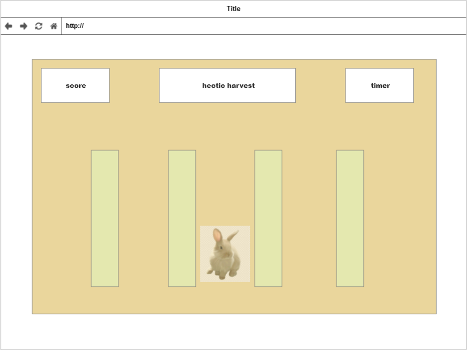

# hectic harvest

## Link to Project

[https://www.hecticharvest.com](hecticharvest.com)

## hop to it

Cozy farming games like Harvest Moon and Stardew Valley are near and dear to my heart. They're a great way to unwind and destress...at least, that's what I used to think. In reality, these games have a frenetic quality that finds me rushing to till fields before the sun goes down, maximize my pumpkin yields (have to harvest today -- it's almost winter!), racing to finish my fishing before the shop closes so I can sell my haul...and the list goes on.

Hectic Harvest is a gentle jab at the strange dichotomy of the stressful peaceful farming sim. You play as Taylor, the harried hare hurrying to bring order to the garden and maximize its output. You'll race against the clock as crops quickly grow across several rows of tilled soil, and the more you can collect before time runs out, the longer you'll be able to _veg out_ and enjoy the _fruits_ of your labor after a hard day's work.

## Wireframe

## Approach

The approach I took to realize my goals for this project was to dive in deep with HTML 5 Canvas. I knew there would be a steep learning curve, but that it would be the most powerful option available to me for running a 2D game with animated sprites in-browser.

## Technologies Used

- This project was made with HTML/CSS/JS.
- Heavily relied on HTML 5's Canvas element/API.

## Project Retrospective

### Wins

This project was a great mix of 'comfort areas' (e.g., DOM manipulation) and tools with which I'm less experienced such as intervals, classes, and -- obviously -- Canvas API. I was fortunate to have a wide variety of challenges over the course of development; there's nothing more maddening than a project where every feature or bit of functionality is a Herculean effort. Here, I had some interesting puzzles that were relatively quick to solve ("how do I ensure plants spawn where I want them to, but also not let them spawn on top of each other?") and others that I really had to live with for a while (implementing sprite animation from a spritesheet).

One particularly gratifying success I'm taking away from this project: I finally have a clearer understanding of the kinds of problems that classes and object-oriented design are great tools for solving.

### Challenges

Much of my development time was a game of triage: at all times I had various conflicting priorities, including getting my MVP features implemented, squashing bugs, refactoring parts of my code to keep it maintainable as I went, and editing/revising the aspects of the application that were already feature-complete. It was not an easy balancing act and there are a few items I'm disappointed I ran out of time for -- I'd have liked to get a broad refactor implemented and reduce the amount of responsibility carried by some of my code blocks (gameLoop is a good example of this). That said, I'm generally happy with how I managed those priorities over the course of the week, and I think in almost every case I picked the option that added the most value to the product.

### Overall

I'm extremely pleased with the result of my work on this project, and I think it forced me to level up my algorithmic thinking, my code organization, my bug-investigation methodology, and my pair programming. I'm very much looking forward to taking the skills honed here and applying them to subsequent projects.

## Sources/Acknowledgements

- Sprites by [Cup Nooble](https://cupnooble.itch.io/), sourced [here](https://cupnooble.itch.io/sprout-lands-asset-pack). This includes the background of the HTML body element.
- Music by [Lolurio](https://lolurio.itch.io/), sourced [here](https://lolurio.itch.io/jazz-bossa-nova-music).
- Logo animation by [juanedcabrera](https://github.com/juanedcabrera).
- Additional thanks to [juanedcabrera](https://github.com/juanedcabrera) for indispensable design consultation and game testing.
